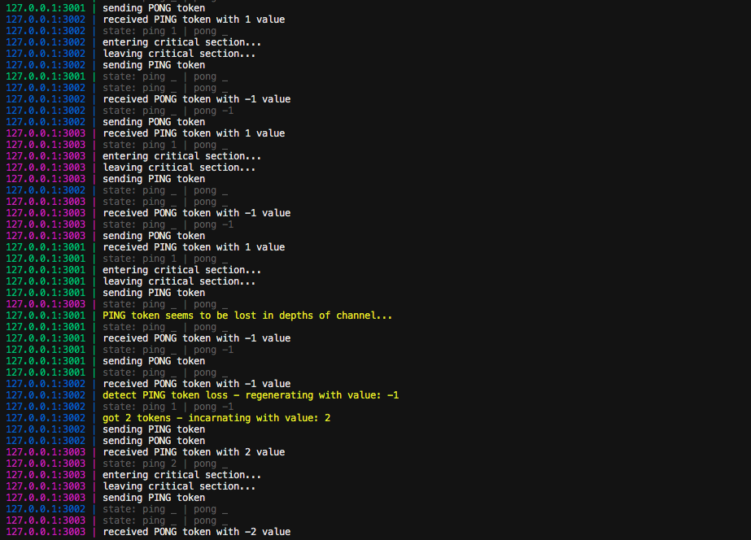
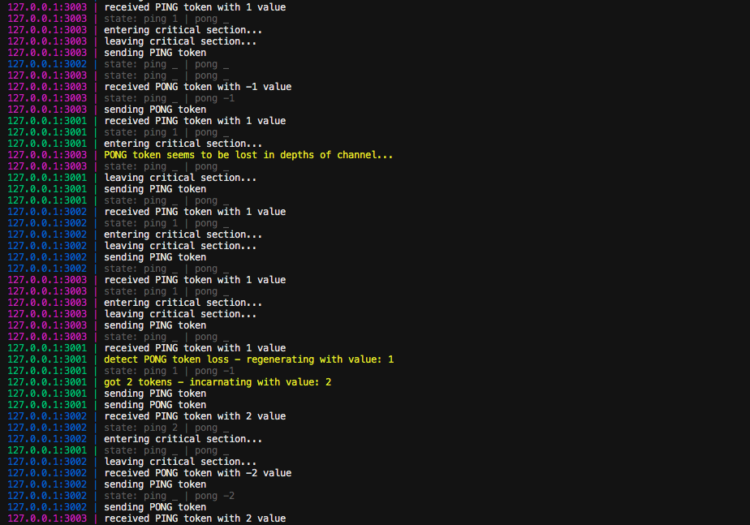

# misra-ping-pong

Misra Ping-Pong algorithm using ZeroMQ

## running locally

```sh
make deps
make build
./bin/main -ping-loss-prob=0 -pong-loss-prob=0.1 127.0.0.1:4001 127.0.0.1:4002 127.0.0.1:4003

# Usage of ./bin/main:
#   -ping-loss-prob float
#         probability of ping token loss in channel
#   -pong-loss-prob float
#         probability of pong token loss in channel
#   address:port [next_address:next_port]
#         list of addresses and ports used by processes for communication
```

## running with Docker

```sh
docker build -t misra-ping-pong ./
docker run -it --rm -e PING_LOSS_PROB=0 -e PONG_LOSS_PROB=0.1 -e ADDRESSES='127.0.0.1:4001 127.0.0.1:4002 127.0.0.1:4003' misra-ping-pong
```

## example log

example log of lost token regeneration for 3 nodes taking part in processing

ping



pong


